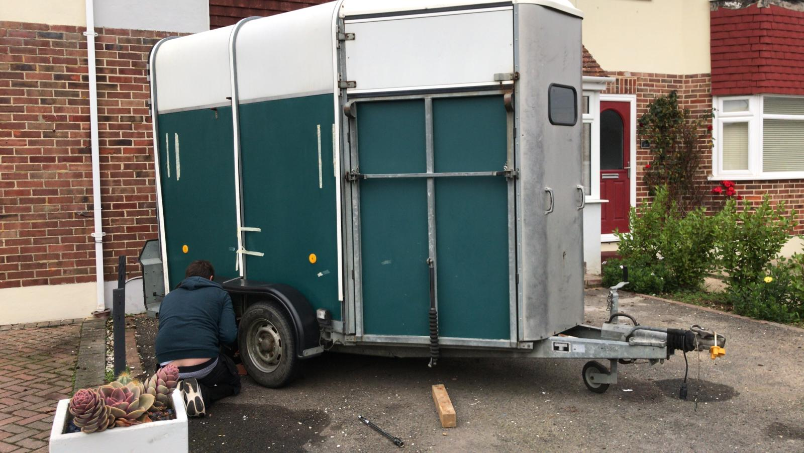
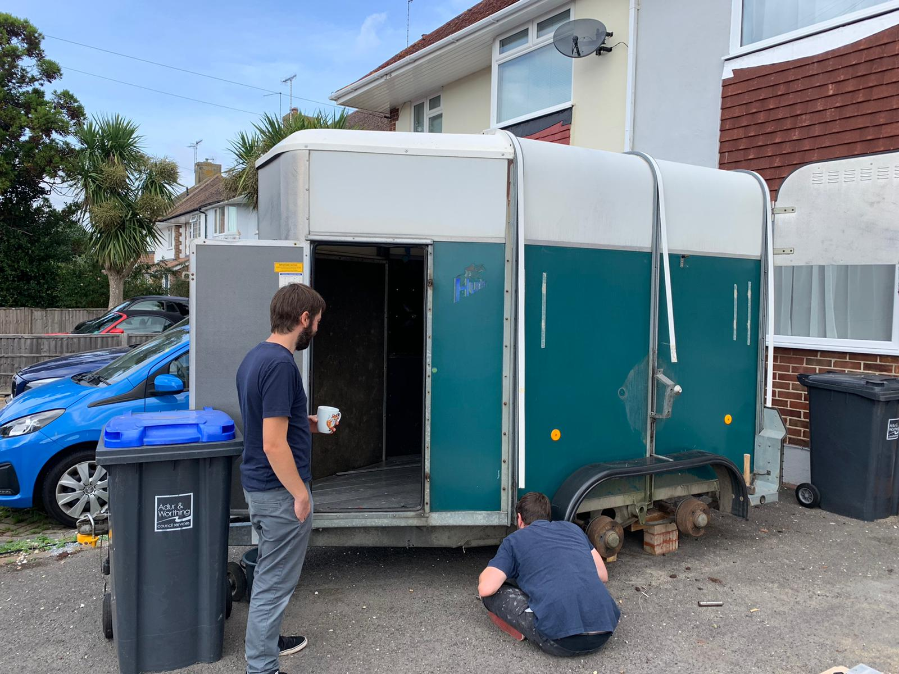
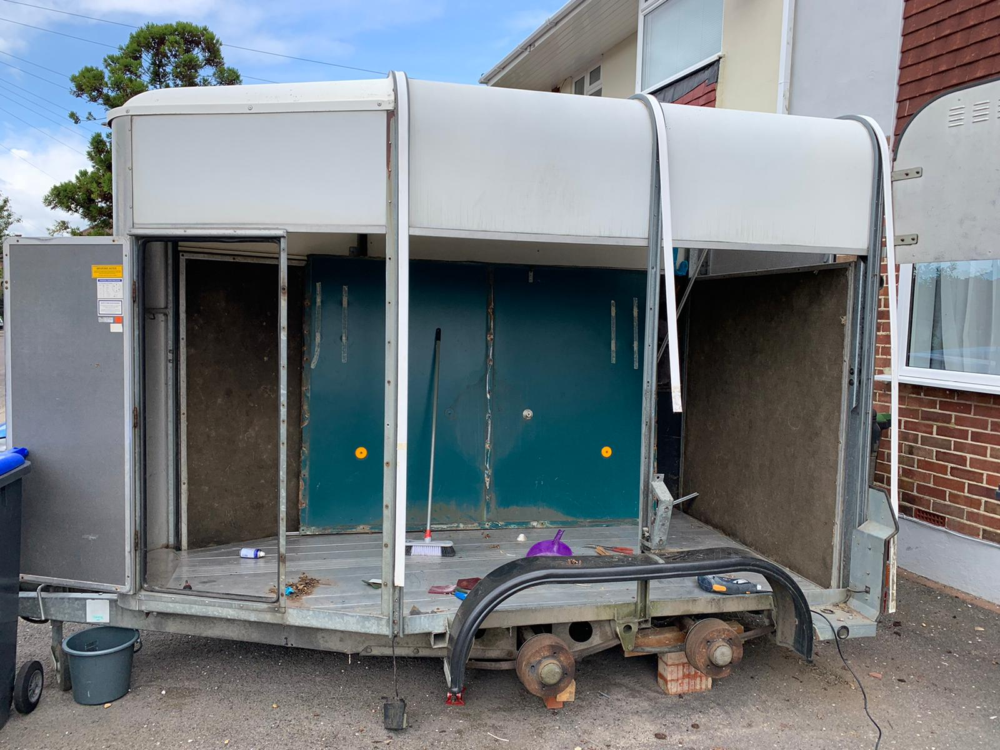
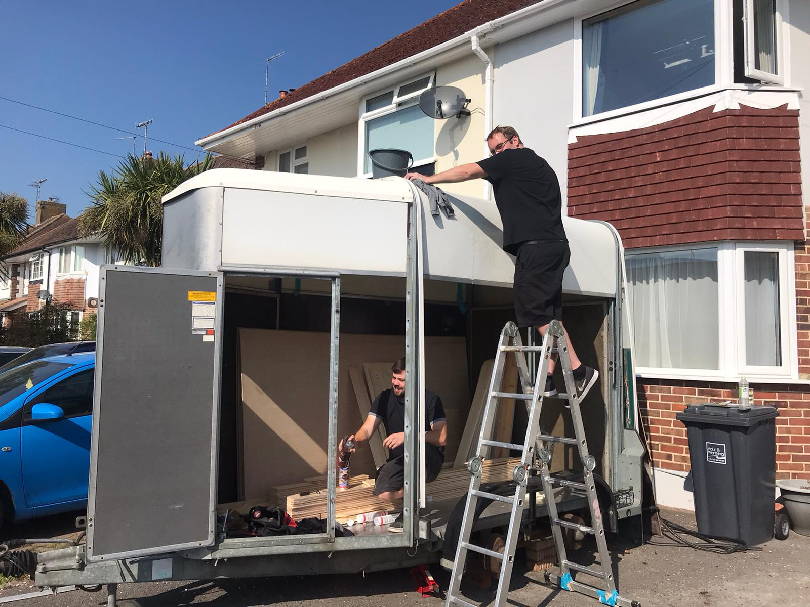
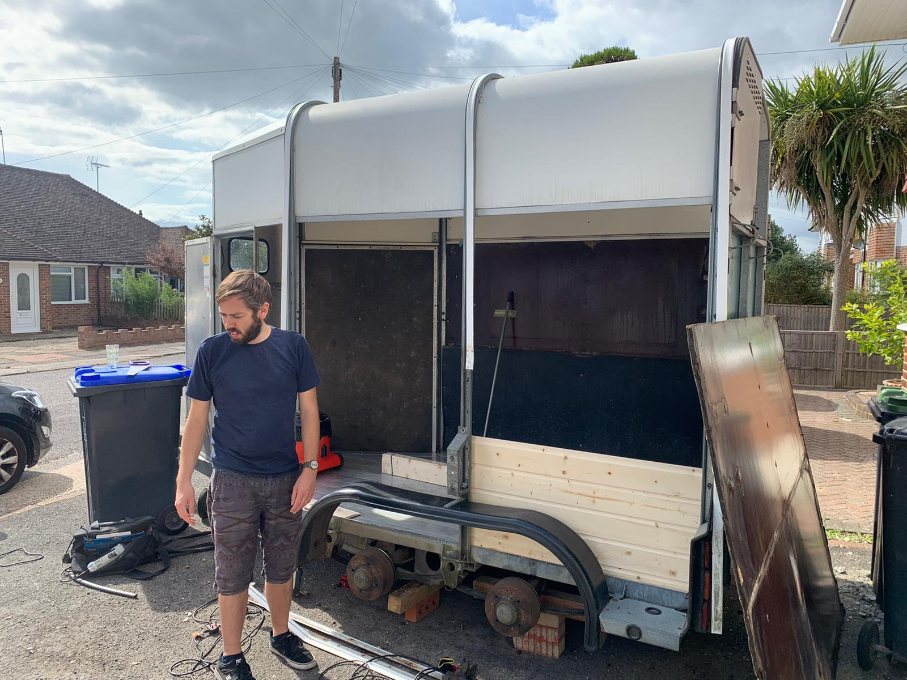
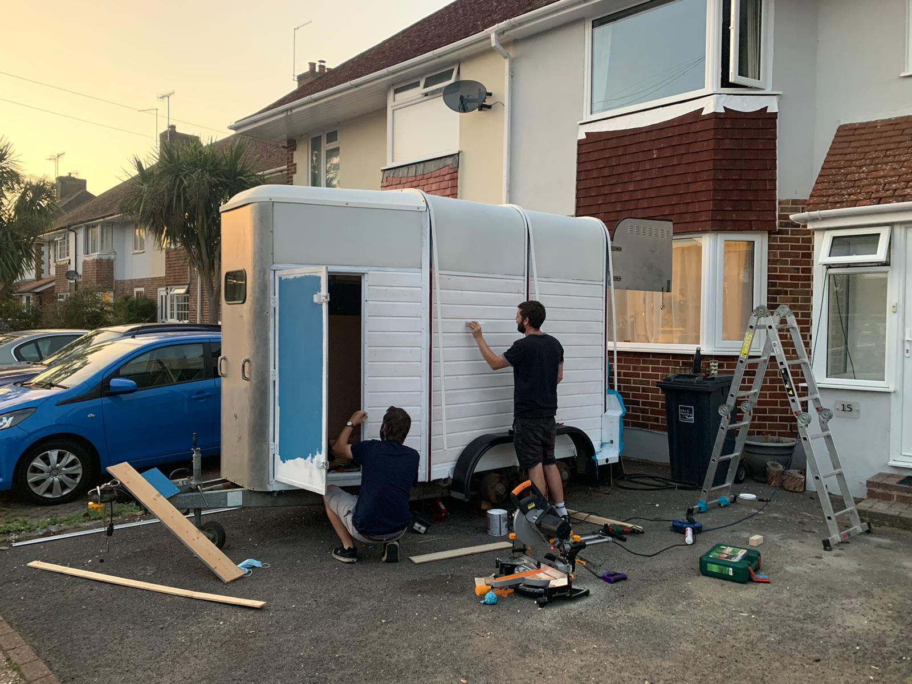
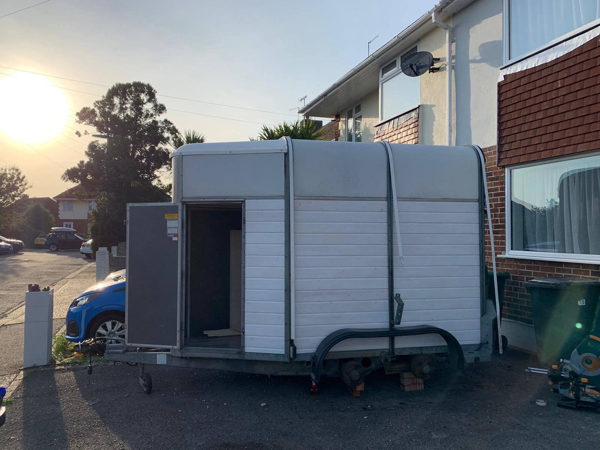
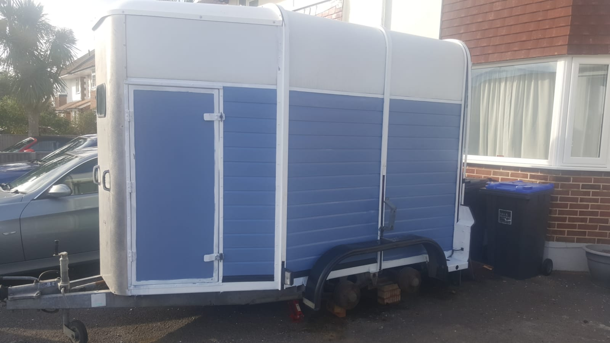
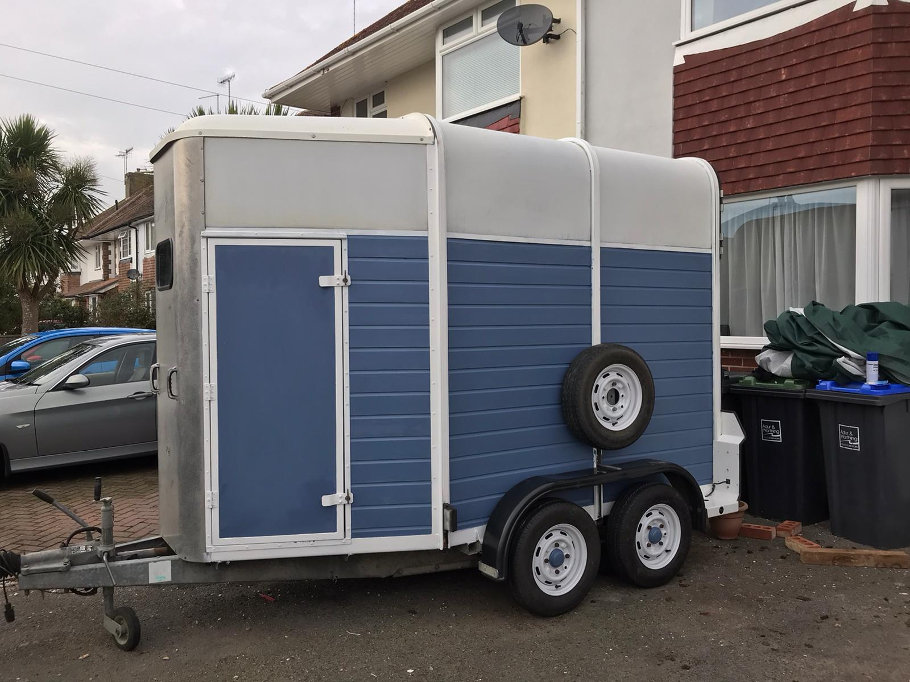

## The first stage of converting our horsebox into a mobile micro-pub!

This is the first in a series of photo blog posts that document the process of converting our horsebox into The Pint & Pony.

After much searching we found an Ifor Williams HB505 horsebox in pretty good condition. We decided to work on the back first, so we could learn from that before tackling the front that will have an opening for the bar.

<ul class="seperator">
    <li>•</li>
    <li>•</li>
    <li>•</li>
</ul>

Shortly after we picked up the horsebox.

<ul class="seperator">
    <li>•</li>
    <li>•</li>
    <li>•</li>
</ul>

We (Tom) soon got to work checking out the state of the suspension, and overall structure of the horsebox - it all looked good!

<ul class="seperator">
    <li>•</li>
    <li>•</li>
    <li>•</li>
</ul>

Still on blocks, we got busy taking out the side panels, and rubbing back the metal ribs.

<ul class="seperator">
    <li>•</li>
    <li>•</li>
    <li>•</li>
</ul>

Duran doing a great job of cleaning up the roof.

<ul class="seperator">
    <li>•</li>
    <li>•</li>
    <li>•</li>
</ul>

Once the roof was cleaned up and the side panels were out, we started replacing them with tongue-and-groove cladding.

<ul class="seperator">
    <li>•</li>
    <li>•</li>
    <li>•</li>
</ul>

Tongue-and-groove cladding installed, the next step was to undercoat the wood and metalwork.

<ul class="seperator">
    <li>•</li>
    <li>•</li>
    <li>•</li>
</ul>

Day one done - time for a well deserved pint!

<ul class="seperator">
    <li>•</li>
    <li>•</li>
    <li>•</li>
</ul>

First coat of blue paint and sealing up the edges.

<ul class="seperator">
    <li>•</li>
    <li>•</li>
    <li>•</li>
</ul>

Final coat on the wood and metalwork, and spruced up the wheels. One side done, time to crack on with the other side!