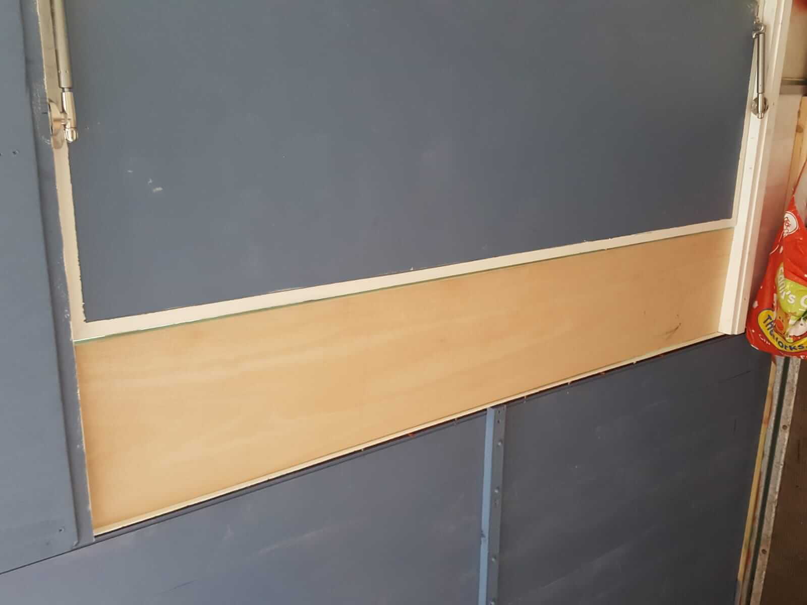

## Converting the front side in lockdown!

With lockdown kicking in, there wasn't the option for us all to work on the conversion, so Tom was on a one man mission to strip down the front side and build the hatch on his own.

<ul class="seperator">
    <li>•</li>
    <li>•</li>
    <li>•</li>
</ul>

The first job was to remove the old panels.

<ul class="seperator">
    <li>•</li>
    <li>•</li>
    <li>•</li>
</ul>

Then to add a couple of new crossbars.

<ul class="seperator">
    <li>•</li>
    <li>•</li>
    <li>•</li>
</ul>

Once the crossbars were added, the next step was to add two vertical bars to take the load once the middle rib was cut out.

<ul class="seperator">
    <li>•</li>
    <li>•</li>
    <li>•</li>
</ul>

With the new frame built, it was time to cut the middle rib and a bit of the roof.

<ul class="seperator">
    <li>•</li>
    <li>•</li>
    <li>•</li>
</ul>

Then to install the new tongue-and-groove cladding.

<ul class="seperator">
    <li>•</li>
    <li>•</li>
    <li>•</li>
</ul>

And paint it up to match the other side.

<ul class="seperator">
    <li>•</li>
    <li>•</li>
    <li>•</li>
</ul>

The next job was to construct and install the top hatch flap.

<ul class="seperator">
    <li>•</li>
    <li>•</li>
    <li>•</li>
</ul>

Then the bottom hatch flap.

<ul class="seperator">
    <li>•</li>
    <li>•</li>
    <li>•</li>
</ul>

A final lick of paint still needed, but this side is almost there.